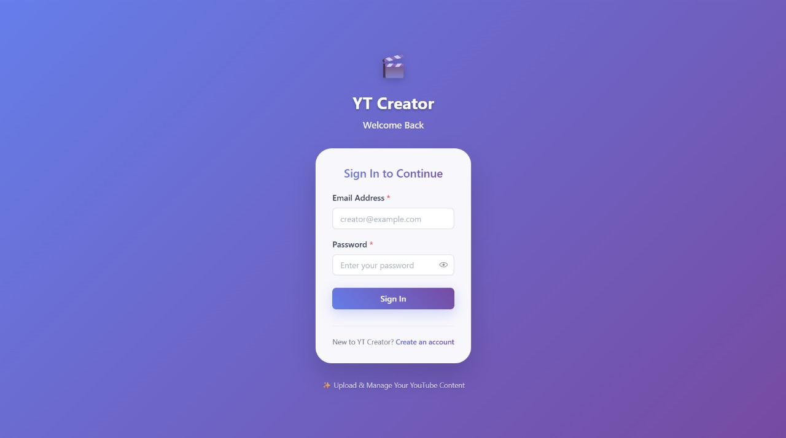
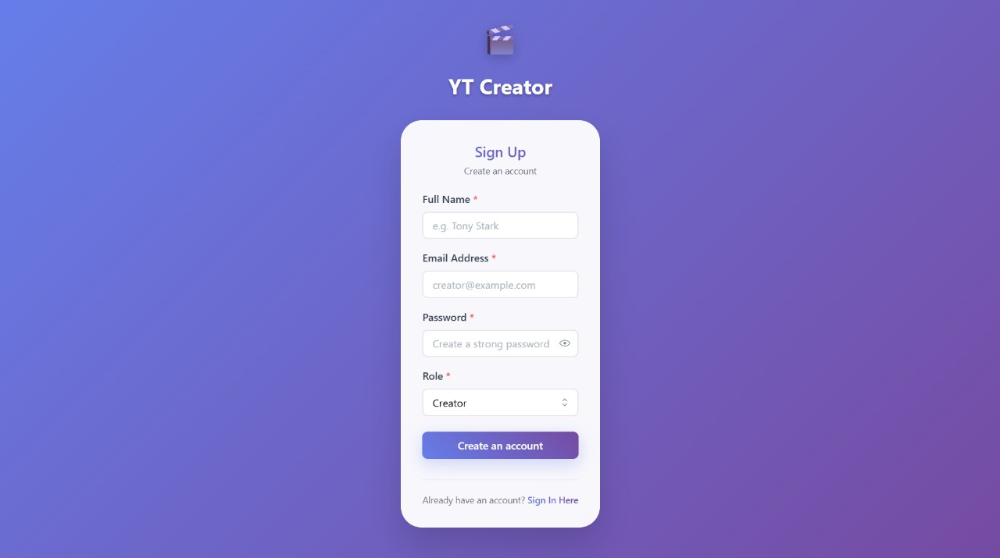
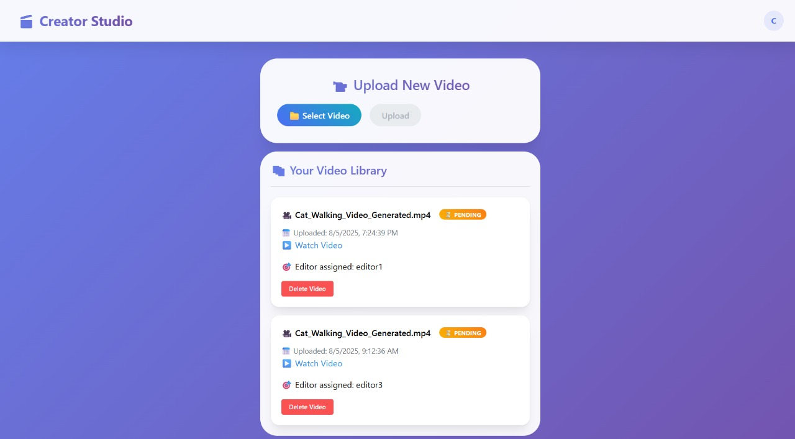
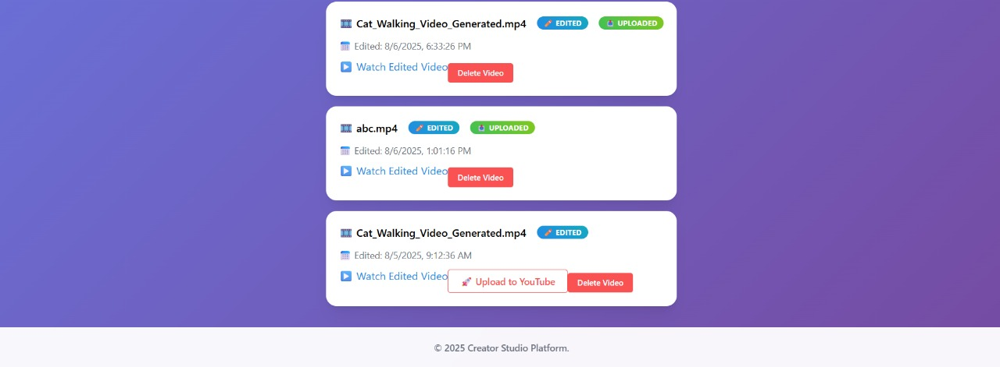

# StudioSync — YouTube Creator–Editor Dashboard

A full-stack dashboard for creators and editors to manage videos, collaborate, and **one-click publish to YouTube**.

- **Frontend:** React
- **Backend:** Node.js + Express
- **Database:** MongoDB + Mongoose
- **Auth & Roles:** JWT (creator/editor)
- **Media:** Cloudinary (video uploads)
- **Publish:** YouTube Data API (OAuth 2.0) with **zero-copy cloud-to-cloud transfer** (Cloudinary → YouTube) — **no local re-download**, reducing storage and bandwidth

---

## ✨ Features

- **One-click publish to YouTube** (YouTube Data API v3, OAuth 2.0)
- **Zero-copy pipeline**: stream from Cloudinary → YouTube without saving locally
- **Creator–Editor collaboration**
  - Creators upload/manage videos and **assign editors**
  - Editors see only the videos assigned to them
- **Secure media handling** via Cloudinary (video uploads)
- **JWT auth** and **role-based authorization**
- **Video metadata** (title, description, tags, privacy, `youtubeVideoId` tracking)

---


## 🖼️ Screenshots

**Sign In —** Secure login for creators and editors using email/password (JWT session).
<br>


**Sign Up —** Account creation with role selection (Creator or Editor).
<br>


**Creator Studio — Upload New Video —** Creators select and upload raw videos to Cloudinary from the dashboard.
<br>


**Creator Library — Manage & Publish —** View uploaded videos, assign editors, and **one-click Upload to YouTube**.
<br>


**Editor Studio — Assigned Work —** Editors see videos assigned to them and can upload edited versions back to the creator.
<br>


**Google OAuth — YouTube Consent —** One-time OAuth 2.0 consent for publishing via the YouTube Data API.
<br>


## 🚀 Getting Started

### Prerequisites
- Node.js 18+
- MongoDB (Atlas or local)
- Cloudinary account (cloud name, API key/secret)
- Google Cloud project with **YouTube Data API v3** enabled  
  Create OAuth 2.0 **Web** credentials (Client ID & Secret)  
  Redirect URI example: `http://localhost:5000/api/youtube/oauth/callback`

### 1) Clone & Install
```bash
git clone https://github.com/lakshyakumar004/youtube-creator-dashboard.git
cd youtube-creator-dashboard

# server
cd server && npm i

# client
cd ../client && npm i

# Terminal 1 — server
cd server
npm run dev

# Terminal 2 — client
cd client
npm run dev
